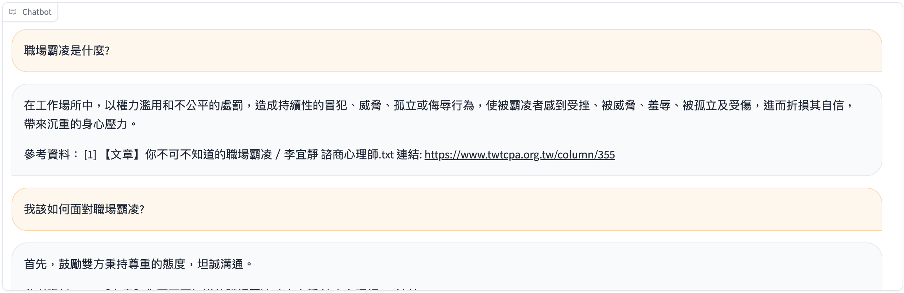
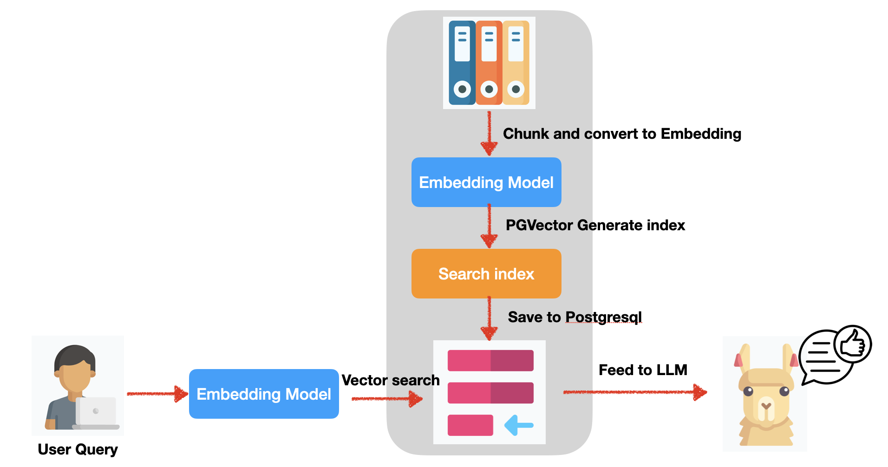

# Mental_RAG_Llama
- 目的: 建立一個心理諮商的聊天機器人，有任何相關心理問題都可以問他
- 通過讓量化過後 llama 2 可以有閱讀多篇文章並回應的能力，並能在 cpu 上執行

# 建立此專案
### 安裝 postgresql
- 安裝 [Postgres.app](https://postgresapp.com/)，我這邊是安裝16版
- 另外我自己有安裝 [pgAdmin 4](https://www.pgadmin.org/download/) 作為 IDE
### 安裝 PGVector
- 參考 [github](https://github.com/pgvector/pgvector) 教學，在mac上會有`termainal`取得權限的問題，可參考此 github 下方的解法
### install requirements.txt
- 因我自己直接在筆電上開發，requirements 是我自己過濾的，可能會有漏套件
```
>> pip install -r requirements.txt
```
### 設置 model
- 創建一個 model 的目錄，將你想要的 GGML 的模型放至於此
- 建立一個 `.env` 檔，設置以下參數:
```
DRIVER=""
HOST=""
PORT=""
DATABASE=""
USER=""
PASSWORD=""
COLLECTION_NAME=""
EMBEDDING_MODEL=""
GGML_MODEL=""
```

### 插入資料
- 目前我爬取[台北市諮商心理師公會](https://www.twtcpa.org.tw/) 的資料，爬取整理成如 `data/mental_article.csv` 的格式
- 將 insert_data_to_pgsql.py 裡的 `insert_data_to_postgresql` 參數 filename 換成你的檔案名稱並執行
```
>> python insert_data_to_pgsql.py
``` 

### 執行
```
>> python demo.py
```

## 結果

# Prompt
- 本專案的prompt，參考[此paper](https://arxiv.org/abs/2305.14627):
    ```
    Write an accurate, engaging, and concise answer for the given question using only the provided search results (some of which might be irrelevant). Use an unbiased and journalistic tone.
    Document [1] 職場霸凌指的是在工作場所中，藉由權力濫用與不公平的處罰，造成持續性的冒犯、威脅、冷落、孤立或侮辱行為，使被霸凌者感到受挫、被威脅、羞辱、被孤立及受傷，進而折損其自信，帶來沉重的身心壓力。可能的方式包
    Document [2] 遭霸凌，其中最多的是言語暴力。霸凌可能會影響員工出勤、專注力、工作效率、職災及殘疾發生。職場上面對霸凌事件大多冷漠以對，被霸凌者多採隱忍、調職或離職。然而，並非每個想離開的人都能順利離開，若無法離開時
    Document [3] 職場霸凌危害甚深，該如何防範呢? 首先，鼓勵雙方秉持尊重的態度，坦誠溝通

    Question: 職場霸凌是什麼?
    Answer:
    ```

# 聊天機器人架構圖
- 模型: Llama 2 13b 
- UI 以 gradio 為主
- 架構圖如下:
    

# TODO
- [ ] token streaming
- [ ] 建立一個更換 domain 資料就可以做不同應用的 LLM 流程
- [ ] 如何讓模型更小
- [ ] 提供可以隨時更換 LLM model 的流程
- [ ] survey attention，並了解是否能減少 inference 所花費的時間
- [ ] function、程式碼配置更完善
